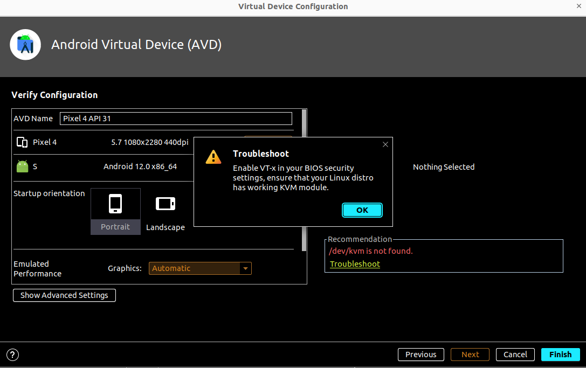

# Android

- [Android](#android)
  - [환경 변수](#환경-변수)
  - [AVD Manager(Android Virtual Device Manager)](#avd-managerandroid-virtual-device-manager)
    - [Virtual Device](#virtual-device)
    - [Physical Device](#physical-device)
  - [디자인](#디자인)
  - [Command-line tools](#command-line-tools)
    - [Android SDK Command-Line Tools](#android-sdk-command-line-tools)
    - [Android SDK Build Tools](#android-sdk-build-tools)
    - [Android SDK Platform Tools](#android-sdk-platform-tools)
    - [Android Emulator](#android-emulator)

## 환경 변수

- [Docs](https://developer.android.com/studio/command-line/variables#envar)

| 환경 변수               | 설명                                                                                                                                                                                            | 경로                                                                                                        |
| ----------------------- | ----------------------------------------------------------------------------------------------------------------------------------------------------------------------------------------------- | ----------------------------------------------------------------------------------------------------------- |
| `ANDROID_HOME`          | SDK 설치 디렉터리의 경로를 설정합니다.                                                                                                                                                          | Ubuntu(`$HOME/Android/Sdk`), macOS(`$HOME/Library/Android/sdk`), Windows(`$HOME\AppData\Local\Android\Sdk`) |
| `ANDROID_USER_HOME`     | Android SDK에 포함된 도구의 사용자 환경설정 디렉터리 경로를 설정합니다.                                                                                                                         | `$HOME/.android`                                                                                            |
| `REPO_OS_OVERRIDE`      | [sdkmanager](https://developer.android.com/studio/command-line/sdkmanager)를 사용하여 현재 시스템과 다른 운영체제용 패키지를 다운로드할 경우 이 변수를 windows, macosx 또는 linux로 설정합니다. | -                                                                                                           |
| `ANDROID_EMULATOR_HOME` | 사용자별 에뮬레이터 구성 디렉터리의 경로를 설정합니다.                                                                                                                                          | `$ANDROID_USER_HOME/avd`                                                                                    |

```ini
; $ANDROID_USER_HOME/avd/<AVD_Name>.avd/config.ini
hw.audioInput = no
hw.audioOutput = no

hw.GPS = no
```

## AVD Manager(Android Virtual Device Manager)

### Virtual Device

> 가상 디바이스를 생성한다.



- BIOS 설정에서 가상화 기능을 활성화 해야 한다.
  - ASUS BIOS + Intel CPU에서는 `Advanced` > `CPU Configuration` > `Intel Virtualization Technology`를 `Enabled`로 설정한다.
  - ASUS BIOS + AMD CPU에서는 `Advanced` > `CPU Configuration` > `SVM Mode`를 `Enabled`로 설정한다.
- 부팅 시 [CPU를 너무 많이 사용](https://stackoverflow.com/questions/37063267/high-cpu-usage-with-android-emulator-qemu-system-i386-exe)한다.

```sh
top -c
# 36654 markrul+  20   0 4083608   2.1g   1.9g S 484.7   6.6  13:26.83 /home/markruler/Android/Sdk/emulator/qemu/linux-x86_64/qemu-system-x86_64 -netdelay none -netspeed full -avd Pixel_4_API_31_-_Android_12 -qt-hide-window -grpc-use-token -idle-grpc-timeout 300
```

- Virtual Device는 생성하면 여러 프로젝트에 걸쳐서 사용할 수 있다.

### Physical Device

> 자신이 사용하고 있는 안드로이드 기기로 직접 확인할 수 있다. (Galaxy Note 9 기준)

- `Settings > About phone > Software information > Build number`를
  [7번 클릭](https://developer.android.com/studio/debug/dev-options)하여 Developer optikons를 활성화한다.
- `Settings > Developer optikons > USB Debugging`을 활성화한다.
- USB 케이블로 모바일 기기를 연결한다.
- Android Studio에서 `Tools > Device Manager > Physical`를 선택한다.
- 모바일 기기 잠금 화면을 풀고 `Allow USB debugging`
- Virtual Device처럼 Run 하면 애플리케이션을 실행할 수 있다.
- 기기 미러링 방법
  - Samsung 스마트폰을 사용한다면 [Link to Windows](https://play.google.com/store/apps/details?id=com.microsoft.appmanager) 앱을 사용해
    PC 화면으로 확인할 수 있다.
  - Android Studio에서 `Settings > Experimental > Device Monitoring`에서
    [Enable mirroring of physical Android devices](https://developer.android.com/studio/preview/features?hl=en#device-mirroring-giraffe)를 활성화하면
    Android Studio의 에뮬레이터로 확인할 수 있다.
    - [Electric Eel Canary](https://developer.android.com/studio/releases#device-mirroring) 채널에서 실험용 기능으로 제공됩니다.

## 디자인

- Empty Project를 생성하면 기본적으로 `/app/src/main/res/layout/activity_main.xml` 파일에서
  화면 정보를 확인할 수 있다.
- [Design for Android](https://developer.android.com/design)
- Android Studio에서 `Design` 탭을 선택하면 화면을 디자인할 수 있다.
  - `Code` 탭을 눌러서 XML 코드를 확인할 수도 있다.

## Command-line tools

- [Docs: 명령줄 도구](https://developer.android.com/studio/command-line)

Android SDK는 앱 개발에 필요한 여러 패키지로 구성됩니다.
Android 스튜디오의 [SDK Manager](https://developer.android.com/studio/intro/update#sdk-manager)
또는 [`sdkmanager`](https://developer.android.com/studio/command-line/sdkmanager)
명령줄 도구를 사용하여 각 패키지를 설치하고 업데이트할 수 있습니다.
모든 패키지는 Android SDK 디렉터리에 다운로드되며, 이 디렉터리는 다음 방법을 통해 찾을 수 있습니다.

- Android 스튜디오에서 **File > Project Structure**를 클릭합니다.
- 왼쪽 창에서 **SDK Location**을 선택합니다. 경로가 **Android SDK location** 아래 표시됩니다.

위치: `android_sdk/cmdline-tools/version/bin/`

### Android SDK Command-Line Tools

- `apkanalyzer`
  - 빌드 프로세스가 완료된 후 APK의 구성에 관한 유용한 정보를 제공합니다.
- `avdmanager`
  - 명령줄에서 Android Virtual Device(AVD)를 만들고 관리할 수 있습니다.
- `lint`
  - 코드를 스캔하여 코드의 구조적 품질 문제를 식별하고 수정할 수 있도록 지원합니다.
- `retrace`
  - R8로 컴파일된 애플리케이션의 경우 retrace는 원본 소스 코드에 다시 매핑되는 난독화된 스택 트레이스를 디코딩합니다.
- `sdkmanager`
  - Android SDK용 패키지를 보고 설치하고 업데이트하고 제거할 수 있습니다.
  - [Docs: sdkmanager](https://developer.android.com/studio/command-line/sdkmanager)

### Android SDK Build Tools

- `aapt2`
  - Android Asset Packaging Tool
  - Android 리소스를 Android 플랫폼에 최적화된 바이너리 형식으로 파싱하고 색인을 생성하며 컴파일한 후 컴파일된 리소스를 단일 출력으로 패키징합니다.
  - [Docs: AAPT2](https://developer.android.com/studio/command-line/aapt2)
- `apksigner`
  - APK에 서명하고 APK 서명이 주어진 APK에서 지원하는 모든 플랫폼 버전에서 성공적으로 인증되는지 확인합니다.
- `zipalign`
  - 압축되지 않은 모든 데이터가 파일 시작 부분을 기준으로 특정 정렬이 적용된 상태로 시작되도록 하여 APK 파일을 최적화합니다.

### Android SDK Platform Tools

- `adb`
  - Android Debug Bridge
  - adb(Android 디버그 브리지)는 에뮬레이터 인스턴스 또는 Android 지원 기기의 상태를 관리할 수 있는 다목적 도구입니다. adb를 사용하여 기기에 APK를 설치할 수도 있습니다.
  - [Docs: adb](https://developer.android.com/studio/command-line/adb)

```sh
adb devices -l
# List of devices attached
# 28ea57e85a3f7ece       device product:crownlteks model:SM_N960N device:crownlteks transport_id:3
```

- `etc1tool`
  - PNG 이미지를 ETC1 압축 표준으로 인코딩하고 압축된 ETC1 이미지를 PNG로 다시 디코딩할 수 있는 명령줄 유틸리티입니다.
- `fastboot`
  - 기기를 플랫폼 및 기타 시스템 이미지로 플래시합니다. 플래시 안내는 Nexus 및 Pixel 기기용 공장 출고 시 이미지를 참고하세요.
- `logcat`
  - 앱 및 시스템 로그를 보기 위해 adb에서 호출합니다.

### Android Emulator

- `emulator`
  - 실제 Android 런타임 환경에서 애플리케이션의 디버그 및 테스트에 사용할 수 있는 QEMU 기반 기기 에뮬레이션 도구입니다.
  - [Docs: emulator](https://developer.android.com/studio/run/emulator-commandline)
- `mksdcard`
  - 외부 메모리 카드(예: SD 카드)의 존재를 시뮬레이션하기 위해 에뮬레이터와 함께 사용할 디스크 이미지를 만들 수 있습니다.
  - [Docs: mksdcard](https://developer.android.com/studio/command-line/mksdcard)
